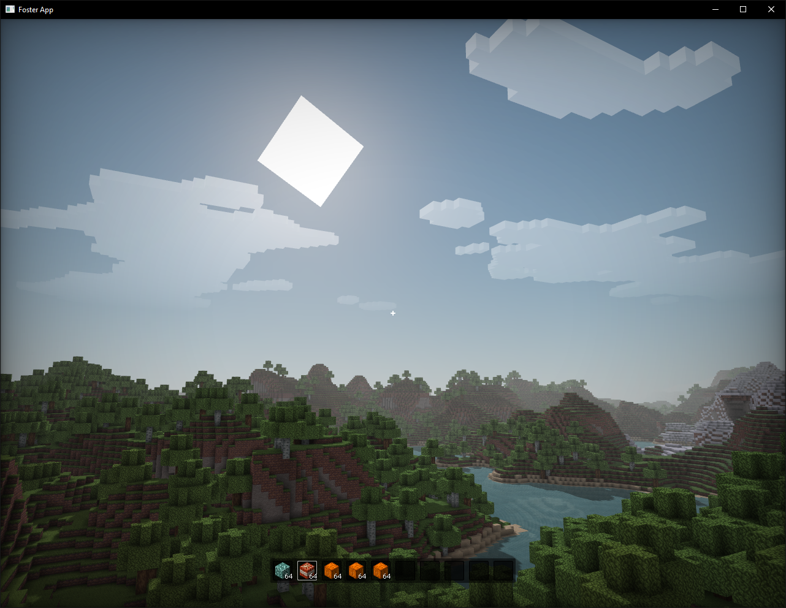

Yet another voxel game, this time made with the Foster framework

Abandoned mid-development so the codebase is very messy and wont receive any cleanup from me, but it's released here anyway :^)

Foster Framework and Foster.Audio are cloned locally with some edits. Most notable is the new update/frame loop in Foster with an implementation [similar to this](https://gafferongames.com/post/fix_your_timestep/), to allow an uncapped render rate while having a fixed update rate. 
Quite lazily, I've only rebuilt the platform libraries for Windows, so if you are on another platform you'll need to compile them first (instructions are available in their folders)

Controls
-------

`WASD` to move, `Space` to jump

`Left Mouse Button` to destroy a block, `Right` to place the block currently selected in your hotbar

`T` or `Middle Mouse Button` to copy the block you're looking at to your hotbar

`Left Alt` or `Esc` to unlock the mouse

`Right Mouse Button` to move sun (while mouse is unlocked)

`B` to open a block selection menu

Credits
-------

Foster Framework
- https://github.com/FosterFramework/Foster

Foster.Audio
- https://github.com/MrBrixican/Foster.Audio

SharpGLTF
- https://github.com/vpenades/SharpGLTF

---

Atmosphere shader by Fewes
- https://www.shadertoy.com/view/lcfSRl

---

Textures are from Eldpack
- https://eldpack.com/
